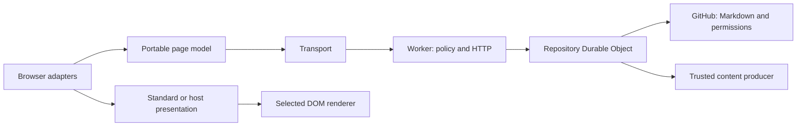

# System design

GitHub owns canonical Markdown, discussions and account permissions. The Worker owns HTTP and website policy. The repository Durable Object owns immutable repository identity, credentials, receipts, ranking and bounded prepared-content reuse. The portable page model owns reading, writing and contribution intent. Browser session, storage, content and presentation are adapters around that model.

## Portable and browser owners

`giscusflare/model` constructs the actual `PageModel` with a transport. It has no browser session, DOM, stylesheet or default content interpreter. `giscusflare/headless` attaches browser authentication, persistence, interaction binding and explicit content choices to that same owner. `giscusflare` adds the standard presentation and GitHub content defaults.

`PageDocument` stores each canonical comment once. Root and reply windows contain ordered IDs, cursors and observed totals. Deliberate restart and order changes replace traversal. Bounded background observation updates loaded content while retaining reading progress; it neither discovers new membership nor promises continuous freshness. Invalid continuity exposes a restart requirement. Responses acquired before accepted changes cannot overwrite those newer overlapping facts.

A writing target identifies a comment, reply or edit destination. A persistent record identifies one independent intent for that destination. Several records can target the same destination without overwriting each other. The active composer and saved recovery choices are separate. Issued writing freezes body, target, receipt key and author; hiding its editor does not cancel or discard it. Explicit recovery selection lets readers restore another record. Claiming one record does not reserve the whole page.

Each independent contribution can dispatch without waiting for unrelated work. A desired-state reaction stream retains its immutable author, subject and reaction; successive requests for that same stream coalesce. Deletion and moderation serialize only their conflicting subject work. Derived public action availability reflects authority, pending work and recovery. Changing account identity retires reads and prevents late accepted output from crossing identities. Remote work already issued can still finish, and `settled()` joins issued work.

## Source preparation and DOM rendering

Canonical Markdown remains authoritative. `contentSource` chooses service delivery: `source`, `github` or `prepared`. `content` chooses how the browser installs that delivery. A local source renderer, GitHub HTML renderer and host-prepared renderer are explicit choices; a renderer does not secretly choose HTTP acquisition through a marker property.

The trusted deployed producer is installed through `createRepository({ content: { revision, prepare } })`. It applies the host's policy for untrusted commenter input and returns safe HTML, producer revision and any required stylesheet/module references. Its result is portable data, not DOM. The existing repository object reuses prepared content independently of the viewer; credentials and viewer-specific permissions are not cached inside producer output. Eligible artifacts persist in its existing store for 24 hours, bounded to 8 MiB and 256 records per object, with a 1 MiB UTF-8 JSON retention limit per item. An 8 MiB hot read cache coalesces concurrent preparation. Producer revision and the full rendering input identify reuse; invalid producer configuration cannot silently serve a retained artifact. Cache retention failure does not reject valid prepared output. Prepared preview uses the same producer without requiring sign-in. GitHub preview retains its own authentication and limits.

`mountContent` prepares output separately from the installed tree. A newer generation cancels preparation, and only the current result commits. Installed output has a distinct lifetime signal: it stays usable while replacement is preparing. Mounted framework updates return commit callbacks instead of changing the live tree during asynchronous preparation. Retiring installed output aborts its lifetime and releases its resources. Failure keeps the installed output; when no output exists, original source remains readable.

Content owns its interpretation, typography, code/math behavior and required resources. Presentation owns surrounding layout, controls and placement. The standard presentation preserves the established successful giscus appearance. Its base layout does not force content styles onto a complete host renderer.

## Confirmed effects and narrow adoption

A contribution receipt binds immutable principal and key to normalized discussion selection and action. Term selection uses repository, term and strictness; number selection uses repository and number. Origin policy, content delivery and new-discussion details are evaluated separately. A confirmed receipt never redispatches merely because those delivery settings changed. The retained `3.` receipt-key format is independent of the `/api/v5/` protocol.

Provider mutation results supply changes owned by that operation: comment fields, deleted IDs, window deltas or the selected reaction group. Partial comment fields merge only their fields, and reaction patches merge only the indicated group. An unrelated broad page observation does not define mutation completion. Optional preparation or ranking work can fail after external confirmation without reopening dispatch or inventing counts.

Public caches keep completed reads until their original expiry. Current website policy applies before cache reuse; authenticated reads bypass public caches. Contributions invalidate affected actor reads. One native alarm selects operational expiry or ranking continuation. Optional alarm scheduling runs through `ctx.waitUntil`; maintenance failure cannot erase an already known contribution confirmation.

## Authentication and ranking

The browser creates its future bearer capability before sign-in. Its hash is the private preparation proof; the proof's hash identifies the public attempt. The authorization window receives the proof in a fragment and removes it before asynchronous work. GitHub PKCE and a browser cookie bind the attempt. Callback installs the encrypted session under the capability hash and deletes the attempt. Return adoption needs no polling. A lost or expired return requires a new sign-in.

Operator-named weighted profiles use typed SQLite observations. A checkpoint enumerates membership after the count/newest-ID signature changes, otherwise renews known IDs. Completed scans report acquisition interval and next refresh time, not an atomic remote snapshot or a uniform source-age guarantee. SQL computes scores, and readers capture an ID sequence before hydrating bounded windows. Native cursor counters meter actual row work; admission and bounded continuation enforce configured budgets. Operation-owned patches update only facts they establish. A selected-reaction correction updates the affected target score in stable thread/profile order memos instead of invalidating and rereading every ranked row. It does not renew the original acquisition age or cadence.

[API](API.md), [customization](EXTENDING.md), [capacity](../FREE-TIER.md) and [verification](CONFIDENCE.md) specify these boundaries in detail.
