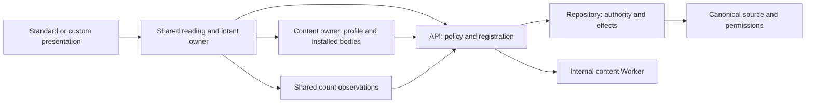

# System design

GitHub owns canonical Markdown, discussions and provider permissions. Deployment registration establishes immutable repository, installation and category identities. The API applies website policy and routes authority; the Repository Durable Object owns credential renewal, sessions, immutable effect receipts and ranking coordination. Interpretation executes in a separate content Worker without commenter credentials.

## Independent facts and availability

Public documents store canonical comments once; root/reply windows hold captured membership, cursors and provider-observed count receipts. The known presentation shell appears immediately. Locally verified account identity and its last verified display profile do not wait for remote participation permissions or body preparation. A missing display profile is acquired directly under identity authority, alongside reading. Public reading survives account changes. Account permissions and selected reactions are a separate principal-bound projection; identity retirement cancels incoming account work without clearing public traversal.

Observation acceptance uses field ownership and original acquisition age. Delayed broad reads cannot replace newer narrow facts, and cached reuse or receipt replay does not renew age. Counts carry explicit selection/root-or-reply window identity, discussion identity, value, observation time and deadline through count-only requests, reading and confirmed effects. Native/custom listing consumers share one browser capability for batching, stale display and optional same-tab retention.

The selected content profile pairs acquisition with interpretation. Its `ContentOwner` binds canonical rendering context, batches missing bodies, accepts reusable hints and owns recovery and active installed mounts. The browser reuses accepted provider hints and installed output; matching active acquisitions are deduplicated. Presentations do not reconstruct acquisition inputs or cache artifacts. Each body prepares detached candidates; only current work commits, while installed output retains its own control/resource lifetime. The selected compiler/resource manifest starts styles concurrently with acquisition. Only generated bodies declaring that manifest fingerprint await them; mismatched open pages keep installed output or safe source and recover with Reload; prose has no code-style dependency. Optional enhancements remain independent, with script-dependent controls unavailable until usable. Counts and local drafts do not wait for body preparation. Return positioning observes needed installed layout without taking over native focus.

The internal producer retains bounded disposable completed artifacts, keyed by revision and canonical input. It has no repository-state lifecycle or credentials. Host profiles constrain commenter input separately from trusted article authoring; the stock profile interprets sanitized GitHub HTML and math. Browser interpretation remains an explicit custom capability.

## Intents and effects

Writing destination and persistent intent identity are distinct. Several records can target one destination. Issued intent freezes body, target, author and receipt key. Hiding its editor does not cancel it; protected unresolved intent remains recoverable as its original author until confirmation or deliberate abandonment.

Independent contributions dispatch independently. Only work sharing a conflicting subject/field serializes; each reaction has its own confirmed and desired state. Preflight failure is not-issued. An ambiguous dispatched outcome is unknown. A confirmed receipt never redispatches because optional readback, ranking or interpretation failed. Operation patches contain only established fields and membership/count observations.

Repository addresses, session encryption and `3.` durable receipt keys remain stable independently of protocol 7. Local sign-out ends local authority immediately; server cleanup has its own outcome. Native initialization and iframe decoding reach the same typed session/writing initialization, retaining stable version 5 storage envelopes without a runtime importer.

## Registration and prerequisites

Operators register repository/installation/category IDs during setup; one repository credential owner renews its token using that installation. Current GitHub results still establish relevant scope, visibility and permissions. Local prepared previews require deployment website policy and the content binding, not current provider admission. Session cleanup requires its stored authority, not a new repository discovery query.

Open hosting issues an installation-backed registration reference bound to its current policy. Ordinary requests cannot allocate arbitrary repository objects from unregistered input. Explicit configured policies override open defaults.

## Cold operation

A count needs registered discussion selection, valid provider access and the count query. A reaction needs its target, authority and provider effect. Preparation needs canonical source/context and one selected interpretation. Registration belongs to setup; optional enhancements remain outside readable publication. Batch necessary provider work and start independent work concurrently. A cache miss performs this necessary work rather than reconstructing configuration.

Measure no reusable result separately from fully cold credential renewal, including when content becomes readable and actions usable. Warm traffic cannot establish either case.

## Ranking and resources

Ranking acquires only required score inputs, meters actual SQLite work and reports the completed acquisition interval. Chronological and ranked readers capture traversal and hydrate bounded windows; corrections do not silently move the reader through a new order. Cadence is not a universal maximum source age. SQL thresholds and upstream-call admission belong to ranking's own budget; they do not cap all account usage.

[API](API.md), [customization](EXTENDING.md), [capacity](../FREE-TIER.md) and [verification](../TESTING.md) explain the public contracts and evidence boundaries.
