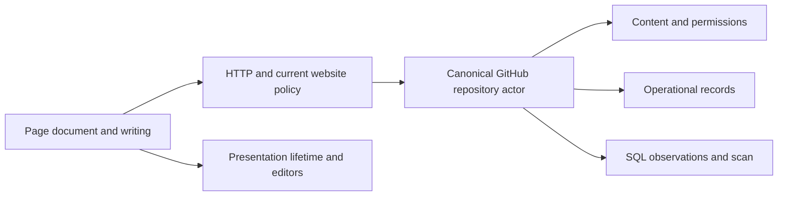

# System design

GitHub owns discussion content and account permissions. One canonical repository actor owns credentials, selection mappings, contribution receipts and optional ranking observations. The Worker resolves a repository name to its installed GitHub identity before selecting that actor. Native and iframe consumers use the same page owner and canonical document.

## Identity and service

Repository names locate; immutable GitHub IDs determine Durable Object addresses. Configured and open-hosting repositories use the same addressing rule. The Worker supplies that identity as a private RPC argument. Each acquired provider result must agree with it. Clients supply a page selection, not repository/category authority hints; the operator's category policy supplies that authority.

`page` acquires a root window, a reply window or a requested sequence of IDs. The provider boundary converts its response once into canonical nodes, ID windows and metadata. Nodes carry content once. Root and reply windows contain membership, pagination and observed totals. Native RPC returns values and expiry; the Worker constructs JSON or the iframe document. There is no second browser DTO or mutation-result conversion.

`contribute` accepts one tagged user intent: comment, edit, delete, reaction or moderation. One acquisition owner resolves the selection, checks scope and acquires the affected nodes. Unmapped first contributions resolve or create a discussion under the same term owner. The durable creation marker handles an uncertain external creation; it is not a second discovery pipeline.

Before dispatch, a receipt records the immutable account and intent fingerprint. Its nullable confirmation is the workflow state: no result means uncertain; a result contains only the external ID, discussion number and affected parent ID. It contains no read body, reactions or counts. Replaying a confirmed intent cannot dispatch another effect. Timestamped intent expiry remains independent of receipt pruning.

A fresh canonical observation can accompany confirmation. Observation failure leaves the effect confirmed, with no patch. The client reports that the contribution was saved and reading needs refreshing. It does not infer global totals from the loaded window or reopen the effect because its display observation failed.

Public edge and actor caches retain bounded completed reads until their original expiry. Current deployment website policy applies before edge reuse; authenticated reads bypass public caches. Confirmed contributions invalidate affected actor reads. One native alarm selects the next operational expiry or ranking continuation.

## Authentication

The page creates its future bearer capability before sign-in. Its hash is the private preparation proof; the proof's hash is the public attempt identity. Only the private proof enters the trusted authorization window, in a fragment removed before asynchronous work. The bearer capability stays with the page and its host persistence.

Preparation binds a browser cookie and independent GitHub PKCE. Callback exchanges credentials, obtains the immutable account ID, atomically creates the encrypted session under the already chosen capability hash, and deletes the attempt. The return carries only public attempt/status. The page adopts its own saved capability; no completion polling, staged ready credentials or second capability issuance exists. Preparation cannot replace an installed capability. A lost return requires another sign-in.

## Reading and writing

The page owns one normalized document, explicit reading windows and contribution records. Refresh replaces reading windows; it does not reconstruct prior expansion depth. Draft records own text, retry key and editor identity together. One contribution queue orders dispatch and canonical patch adoption. Reaction intent concerns issued and desired commands rather than deriving another write from a possibly stale read.

Read signals belong to their acquisition. Replacing the root document retires child acquisitions. Changing identity retires prior acquisitions and queued contributions; issued remote effects can finish but cannot publish into the replacement. The page can join its issued work. There is no mixed registry combining drafts, reaction intent, reply loading and arbitrary operation status.

The mount owns page and presentation replacement. Consumers observe the actual current page directly. Presentations receive an abortable view lifetime; renderer-owned descendants register cleanup when acquired. An editor owns its actual form, textarea, preview and native interactions. Active editors occupy a permanent region independent of read-window membership. The main editor also has one insertion point; visual position uses CSS. Native history does not depend on moving textareas during render.

## Ranking

An operator names weighted root-comment profiles. SQL holds typed observations. One collection checkpoint owns a two-mode scan: enumerate membership after the count/newest-ID signature changes, otherwise renew known IDs. Completed scans report an acquisition interval and next refresh time. This is a refresh cadence and a scoped traversal, not an atomic remote snapshot or a uniform bound on every field's age.

Returning source observations cannot overwrite a newer complete local fact. Canonical contribution observations supply complete facts, so ranking has no partial-fact merger or missing-input repair protocol. SQL computes scores; a bounded cache holds completed scored orders. A reader receives a copied ID sequence and hydrates explicit windows without reordering that traversal halfway through reading.

Native SQL cursor counters meter actual row work. HTTP calls are admitted against the configured allowance; SQL scheduling stops between bounded steps when its threshold is reached. Thresholds can overshoot by the final bounded step. The implementation has no prepaid per-operation row reservations, emergency global invalidation or legacy ranking migration. [Capacity](../FREE-TIER.md) records the measured workload and its limits.

[Migration](MIGRATION.md), [API](API.md), [customization](EXTENDING.md) and [verification results](CONFIDENCE.md) describe adoption and evidence. The replacement ledger includes new contracts, consumers and verification support.
