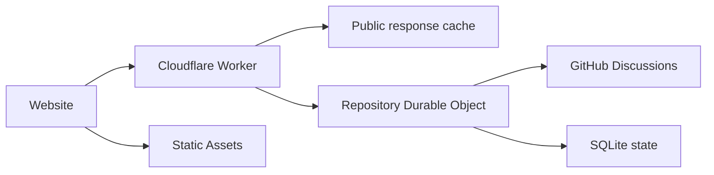

# Architecture

Giscusflare connects a website to GitHub Discussions. A Cloudflare Worker checks requests and public response caches; a SQLite Durable Object coordinates each repository's GitHub access, sessions and writes. Static Assets serves browser code, styles and setup.

GitHub stores comment content. SQLite keeps durable state such as page mappings, encrypted sessions, creation records and mutation receipts. Optional ranking adds derived metadata in the same repository object.

## Browser contract

The public conversation object owns sign-in, drafts, read state, pagination and write intent. Presentations subscribe to normalized state and call its commands. The default interface and the independent forum example use that same contract.

A presentation owns its DOM and listeners. Appearance changes keep the conversation and editors. Replacing the page saves the old draft and starts a conversation for the next identity. Stable comment and editor IDs let a renderer preserve textarea nodes during refresh.

Reactions display the reader's latest intent while writes for that target serialize. Confirmed results reconcile into the comment collection. A submission keeps its draft and retry identity until it has a definite result.

## Reads and writes

Anonymous GET responses can be reused at the Worker and inside the object. Their expiry starts with the original read and does not restart when a response enters another cache. Viewer-specific responses bypass public caching. Policy is checked before cache lookup.

Read RPC returns a completed payload: status, headers and a serialized body. The object owns JSON serialization and cache expiry; the Worker reconstructs HTTP without parsing the body. Keeping live response streams within their originating runtime avoids the Response-over-RPC failure described in [workerd issue 7277](https://github.com/cloudflare/workerd/issues/7277).

Iframe HTML carries the first anonymous comment page. The browser can render it without a second initial thread request. Native presentations request that page directly.

Mutations return confirmed values to the writer and invalidate object reuse. A revision check prevents a read started before a write from refilling the cache with its older result. Other edge locations may retain public responses until their original expiry.

Timestamped operation IDs bound the retry window. Existing receipts are checked before age validation. Completed receipts can replay their result; pending records retain uncertainty. An expired identity without a receipt cannot become a new write.

## Optional ranking

Chronological reads need only the requested page. A whole-discussion ranking also needs each root's selected score inputs. Named operator profiles define those inputs and weights.

Ranking stores compact candidate groups with an ID locator. It writes changed groups, coalesces demand and advances work in bounded steps. Request and row allowances are reserved before work. Profile scores share metadata and the browser retains an ordered ID traversal while hydrating visible pages.

A complete order requires complete membership and valid observations. The oldest required observation determines freshness. Missing data, upstream throttling and exhausted budgets produce explicit preparation or pause states. Ordinary comment reading and writing remain available.

## Code map

| Directory | Responsibility |
| --- | --- |
| `src/contracts` | Request, configuration and upstream schemas |
| `src/worker` | HTTP policy, Cache API, rate limits and Durable Object RPC |
| `src/domain` | GitHub access, scope checks, sessions, mappings and receipts |
| `src/ranking` | Metadata collection, storage, budgets and ordering |
| `src/conversation` | Browser state, commands, drafts and reaction intent |
| `src/browser` | Browser lifecycle, content rendering and interaction bindings |
| `src/browser/standard` | Default presentation |

Hono and Valibot stay in the service build. The headless browser entry excludes the default presentation. [Packaging](PACKAGING.md) describes the published artifacts and selected static assets.
