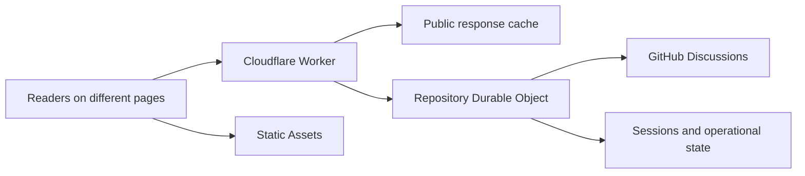

# How giscusflare works

Giscusflare connects your website to GitHub Discussions. GitHub stores the comments. A Cloudflare Worker handles requests from readers, and one SQLite Durable Object per repository coordinates GitHub access, sessions and writes. Static Assets serves the browser code, themes and setup page.

SQLite stores page-to-discussion mappings, encrypted sessions, discussion-creation records and write receipts. If you enable ranking, it also stores the inputs needed to order comments.

## Loading a conversation

The Worker checks your repository and website policy before looking for a cached response. For anonymous readers, it can serve a public response from Cloudflare's local cache. On a miss, it calls the repository object. The object has another shared cache and combines identical reads in progress into one GitHub fetch.

Data caches distinguish the discussion, cursor, order and reply selection. Themes, layout and the embedding page URL do not split those entries. Each request still passes the current website and repository policy. A response keeps its original expiry as it passes between caches. Signed-in reads use the reader's GitHub token and bypass public caching so permissions and selected reactions belong to that reader.

An iframe response includes the first anonymous comment page. A native presentation requests that page through the API. Further comments and replies load as the reader asks for them.

The repository object serializes the response once and passes its body, status and headers to the Worker. The Worker returns that body without parsing and serializing the JSON again.

## Traffic across pages

All discussions in one GitHub repository share a Durable Object. Readers do not get their own objects, and opening another website page does not allocate one. Separate repositories use separate objects.

This arrangement shares installation tokens and repository checks across pages. It also coordinates discussion creation and retries so concurrent readers do not create duplicate discussions or submissions. Different requests can wait for GitHub concurrently; the object does not process an entire network round trip before accepting the next request.

The current implementation has several consequences for a busy site:

- Repeated anonymous reads of the same page can share cached content. Readers visiting different discussions need different responses.
- The repository's in-memory response cache has an 8 MiB limit. Least recently used entries are evicted when new responses need room. Keys and entry overhead count toward the bound.
- A comment, edit, deletion, moderation action or reaction invalidates reads for its discussion. Unrelated discussions retain their entries. Existing edge responses retain their original expiry.
- All signed-in reads, writes and cache misses for the repository reach the same object. Their CPU and GitHub work accumulate there.
- Count requests batch up to 20 page identifiers. Individual counts and missing-discussion results are shared across batches and website pages. Only misses reach GitHub, in one query that also verifies repository access.

These choices make the repository the unit of coordination. [Cloudflare usage](../FREE-TIER.md) explains the costs for repeated and scattered traffic.

## Writing and retrying

A write returns GitHub's confirmed result to the reader. The conversation updates immediately. Other readers receive it through subsequent reads.

Before sending a mutation, the service records its operation ID and content fingerprint. If a response is lost, that record lets a retry recover the original operation instead of blindly submitting again. Completed receipts return the saved result. Pending receipts preserve the uncertain outcome. An expired operation ID without a receipt cannot start a new write.

Invalidation removes both retained entries and pending-work registrations for the discussion. A read that started before the write may finish for its original caller, but cannot refill the cache afterward.

## Optional ranking

Chronological reading needs only the requested comment page. Ranking needs each root comment's selected score inputs. Operator-defined profiles choose those inputs and their weights.

Ranking starts when a reader requests a profile. Readers of the same discussion share the collection work. The service advances it in bounded steps, reserves API and storage allowances before each step, and uses alarms to finish pending work. Completed jobs stop scheduling alarms. Another visit starts a refresh when the observations are too old.

The stored candidates contain ranking metadata rather than full comment bodies. Once an order is ready, the browser retains its ID list and fetches content for the visible pages. Reaction changes do not move comments across pages during that reading session.

Ranking state persists separately for each discussion. Byte-bounded caches retain candidates for multiple discussions and orders for multiple profiles. Candidates have a 32 MiB retained-memory estimate, including ID lookup overhead; orders share a 4 MiB limit. Discussions in the same repository share its ranking budget.

Ready rankings reuse public access verification for the display-cache lifetime. Preliminary GitHub calls and installation-token renewal are included in the ranking request allowance. Local website policy is checked on every request.

If collection is incomplete or reaches its budget, the API reports `preparing` or `paused`. A presentation can keep chronological reading available while the ranked view catches up. [Configuration](CONFIGURATION.md#enable-ranked-views) describes the controls.

## Browser and presentation

The conversation object owns sign-in, drafts, loaded comments, pagination and pending writes. A presentation subscribes to that state and supplies the DOM and controls. The default widget and forum example use the same API.

Theme changes retain the conversation and its editors. Changing the page saves its draft and starts a conversation for the next page. Stable comment and editor IDs let presentations update content without replacing a focused textarea.

## Source map

| Directory | Responsibility |
| --- | --- |
| `src/contracts` | Request, configuration and GitHub response schemas |
| `src/worker` | HTTP policy, public caching, rate limits and object calls |
| `src/domain` | GitHub access, authorization, sessions, mappings and receipts |
| `src/ranking` | Metadata collection, storage, budgets and ordering |
| `src/conversation` | Browser state, commands, drafts and reaction intent |
| `src/browser` | Browser lifecycle, content rendering and interaction bindings |
| `src/browser/standard` | Default presentation |

The Worker and browser have separate builds. Custom interfaces can import `giscusflare/headless` without the default presentation. See [package assets](PACKAGING.md) for the published modules and deployment files.
