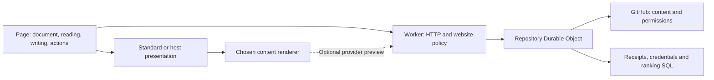

# System design

GitHub owns stored discussion content and account permissions. The Worker owns HTTP, website policy and canonical repository selection. One repository Durable Object owns credentials, mappings, contribution receipts and ranking observations. One browser page owns reading, writing and ordered effects. Presentation and content rendering have separate, replaceable resource lifetimes.

## Browser ownership

`PageDocument` stores each canonical node once. Root/reply windows own ordered IDs, continuation cursors and observed totals. `start`, `restart`, `loadMore`, `loadReplies`, `setOrder` and `revalidate` distinguish acquisition purposes. Restart and order changes deliberately replace traversal. Background revalidation observes a bounded set of loaded IDs, retaining membership/order/cursors and removing confirmed missing nodes. Successive observations rotate through loaded content. It does not silently reset expansion or promise all loaded content is always fresh. Identity changes or invalid continuations expose a restart requirement.

A `Writing` owns immutable contribution destination, text, visibility and clear undo. An issued contribution freezes target/body/key/author; that identity survives hiding and persistence, including reload during dispatch. Hidden writing cannot submit until reopened. Uncertain writing is protected from edits and clearing; retry recovers the original effect. Explicit abandonment belongs to a deliberate reader decision and cannot undo an external effect. Protected persisted snapshots survive ordinary writing retention and sign-out; a known outcome or explicit abandonment returns them to ordinary retention. Browser persistence is best effort and can be disabled explicitly. Editor state is not contribution identity.

One effect queue serializes dispatch and canonical patch adoption. Reaction intent retains desired/issued commands; deletion and moderation retain unresolved effects. Public action availability derives from those owners and current authority, without a second mutable action store. Changing account identity retires reads and queued work; issued remote effects may finish, but cannot publish into a replacement identity. A page can join its already issued work.

The mount owns page replacement and an independently replaceable presentation. Consumers observe the actual page, not a projected state or forwarding facade. Presentations own acquired resources through abort signals. The optional native editor owns its form, textarea, preview and native interactions; writing outlives that DOM. The standard main editor has one permanent insertion point, with CSS controlling visual position. Reply/edit forms remain presentation choices rather than determining writing targets.

## Content ownership

Headless consumers explicitly choose a `ContentRenderer`. The standard mount supplies the optional GitHub renderer unless replaced. Every renderer receives original Markdown and purpose/context; provider HTML is lazy. A local pipeline does not make a provider preview call or acquire unused provider HTML in reads and contribution observations. The optional GitHub renderer opts into that HTML explicitly. Custom output can be asynchronous or a mounted tree with update/dispose methods. It owns its safe interpretation, styles and resources.

`mountContent` owns both published bodies and previews: unchanged inputs retain output; changed generations cancel work; removed output is disposed; late output cannot install. Rendering failure leaves readable source. There is no separate preview-HTML channel or body enhancement lifecycle.

The optional GitHub renderer sanitizes provider HTML and supplies code/math presentation. Feature overrides own complete output, including frames and controls. Disabling a feature preserves sanitized readable source. Built-in math is loaded only when selected and present. Content CSS is independently importable; the standard appearance remains the pinned giscus visual reference.

## Service identity and effects

Repository names locate; immutable GitHub IDs select Durable Object addresses. Configured/open hosting use the same addressing rule. The Worker supplies identity as a private RPC argument; acquired provider data must agree with it. Clients supply page selection, not category or repository authority. Operator policy chooses the category.

`page` acquires roots, replies, explicit IDs or an observation of loaded content. The provider boundary converts once to canonical nodes/windows/metadata. RPC returns values and expiry; the Worker constructs JSON or the iframe document. `contribute` accepts tagged comment/edit/delete/reaction/moderation intent. One acquisition path resolves selection and fresh scope. First contribution resolution/creation shares the term owner; an uncertain external creation has a durable marker.

Before dispatch, a receipt records immutable principal and intent fingerprint. Nullable confirmation is its workflow state: absent result means uncertain; confirmed result contains only external ID, discussion number and affected parent. It contains no saved read body, reactions or counts. Replay cannot redispatch a confirmed effect. Optional fresh observation supplies a canonical patch; observation failure leaves the effect confirmed rather than inventing counts or reopening dispatch. Version 4 uses `/api/v4/` while retaining the `3.` durable receipt-key format.

Public edge/actor caches retain completed reads until original expiry. Current website policy applies before edge reuse; authenticated reads bypass public caches. Contributions invalidate affected actor reads. One native alarm selects operational expiry or ranking continuation.

## Authentication

The page creates its future bearer capability before sign-in. Its hash is the private preparation proof; the proof's hash is the public attempt ID. Only the proof enters the trusted authorization window, in a fragment removed before asynchronous work. The capability stays with page persistence.

Preparation binds a browser cookie and independent GitHub PKCE. Callback exchanges credentials, obtains immutable account ID, atomically installs the encrypted session under the chosen capability hash, and deletes the attempt. Return carries only public attempt/status. The page adopts its saved capability without polling, staged credentials or second issuance. A lost return requires another sign-in. Preparation cannot replace an installed capability.

## Ranking

Operator-named weighted profiles use typed SQL observations. One checkpoint owns a two-mode scan: enumerate membership after the count/newest-ID signature changes, otherwise renew known IDs. Completed scans report acquisition interval and next refresh time: cadence and scoped traversal, not an atomic snapshot or uniform source-age guarantee.

Older remote observations cannot overwrite newer complete local facts. Canonical contribution observations update complete facts directly; there is no partial-fact merger. SQL computes scores; a bounded cache retains completed orders. Readers copy the ID sequence and hydrate bounded windows without changing order halfway through reading.

Native SQL cursor counters meter actual row work. HTTP admission enforces the configured allowance before provider calls. SQL scheduling stops between bounded steps; the final step can overshoot its threshold. There are no per-operation reservations, emergency global invalidation or legacy ranking migration. [Capacity](../FREE-TIER.md) records workload conditions and limits.

[API](API.md), [customization](EXTENDING.md) and [verification](CONFIDENCE.md) describe the public contracts and their evidence.
